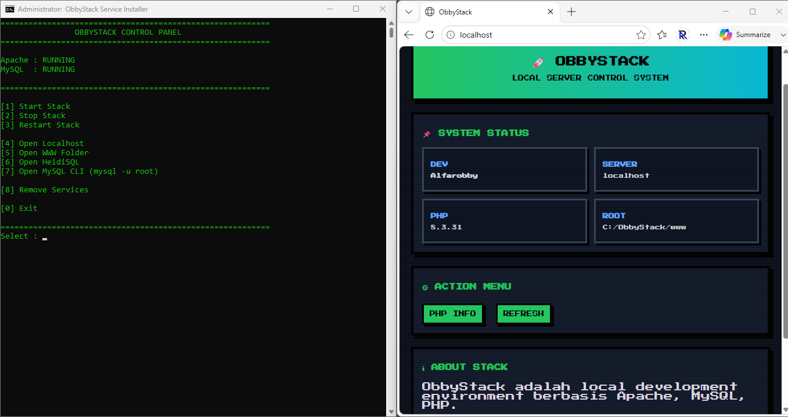

# ObbyStack

<p align="center">
  
</p>


ObbyStack adalah local development stack untuk Windows yang dirancang untuk memudahkan developer menjalankan environment web development secara cepat, ringan, dan sederhana.

Stack ini terdiri dari:

- Apache Web Server
- MySQL Database Server
- PHP
- HeidiSQL
- WWW Folder (Project Web Root)

Cocok untuk development PHP native, Laravel, CodeIgniter, dan project web berbasis MySQL lainnya.

---

# Fitur Utama

- Simple local development stack untuk Windows
- Start / Stop / Restart stack melalui control panel
- Auto service installer saat first setup
- Apache & MySQL berjalan sebagai Windows Service
- Built-in HeidiSQL
- Built-in MySQL CLI
- Folder project web default di `www`

---

# Download

Download versi stable terbaru melalui halaman **GitHub Releases**:

[](https://github.com/Alfarobby27/ObbyStack/releases/tag/ObbyStack)

# Persyaratan Sistem

Sebelum memulai, pastikan komputer Anda memenuhi syarat berikut:

- Windows 10 / Windows 11 (64-bit)
- Memiliki akses Administrator
- Tidak menggunakan local development lain (XAMPP, Laragon, WAMP, dll)

Disarankan install di:

```bat
C:\ObbyStack
```

> Jalankan `obby.bat` menggunakan **Run as Administrator**

---

# Instalasi / Setup

## 1. Download ObbyStack

Download file:

[](https://github.com/Alfarobby27/ObbyStack/releases/tag/ObbyStack)

Setelah download selesai, extract ZIP ke:

```bat
C:\ObbyStack
```

Struktur folder setelah extract:

```text
C:\ObbyStack
├── apache
├── control
├── heidisql
├── mysql
├── php
├── www
└── obby.bat
```

---

## 2. Buat Folder Data MySQL

Buat folder berikut:

```bat
mkdir C:\ObbyStack\mysql\data
```

Struktur:

```text
C:\ObbyStack\mysql\data
```

> Folder ini wajib ada sebelum MySQL diinisialisasi.

---

## 3. Inisialisasi Database MySQL

Buka CMD sebagai Administrator lalu jalankan:

```bat
cd C:\ObbyStack\mysql\bin
mysqld --initialize-insecure --datadir=C:\ObbyStack\mysql\data
```

Penjelasan:

- `--initialize-insecure` → root tanpa password
- `--datadir` → lokasi folder data MySQL

Jika berhasil, folder `data` akan otomatis terisi.

---

## 4. Jalankan ObbyStack

Jalankan:

```bat
C:\ObbyStack\obby.bat
```

Klik kanan → **Run as Administrator**

---

## 5. First Setup (Install Service)

Saat pertama dijalankan, ObbyStack akan mengecek service:

- ObbyApache
- ObbyMySQL

Jika belum ada, akan muncul:

```text
OBBYSTACK FIRST SETUP

Apache & MySQL Service belum terinstall.

[1] Install Service
[0] Exit
```

Pilih:

```text
[1] Install Service
```

ObbyStack akan otomatis menginstall service Apache & MySQL.

---

# Control Panel Menu

Setelah setup selesai, panel utama:

```text
[1] Start Stack
[2] Stop Stack
[3] Restart Stack

[4] Open Localhost
[5] Open WWW Folder
[6] Open HeidiSQL
[7] Open MySQL CLI (mysql -u root)

[8] Remove Services

[0] Exit
```

---

# Cara Menggunakan

## Start Stack

Menjalankan Apache + MySQL.

```text
[1] Start Stack
```

---

## Stop Stack

Menghentikan Apache + MySQL.

```text
[2] Stop Stack
```

---

## Restart Stack

Restart Apache + MySQL.

```text
[3] Restart Stack
```

---

## Open Localhost

Membuka browser ke:

```text
http://localhost
```

```text
[4] Open Localhost
```

---

## Open WWW Folder

Membuka folder project web.

```text
[5] Open WWW Folder
```

Lokasi:

```text
C:\ObbyStack\www
```

---

## Open HeidiSQL

Menjalankan HeidiSQL.

```text
[6] Open HeidiSQL
```

---

## Open MySQL CLI

Membuka terminal MySQL:

```sql
mysql -u root
```

```text
[7] Open MySQL CLI
```

> MySQL harus dalam kondisi RUNNING.

Default user:

```text
root
```

Default password:

```text
(no password)
```

---

## Remove Services

Menghapus service:

- ObbyApache
- ObbyMySQL

```text
[8] Remove Services
```

---

# Struktur Folder

```text
ObbyStack/
├── apache/
├── control/
├── heidisql/
├── mysql/
│   └── data/
├── php/
├── www/
├── obby.bat
├── README.md
└── LICENSE
```

---

# Default URL

```text
http://localhost
```

---

# Root Web Folder

Simpan project Anda di:

```text
C:\ObbyStack\www
```

Contoh:

```text
C:\ObbyStack\www\project-saya
```

Akses:

```text
http://localhost/project-saya
```

---

# Troubleshooting

## Apache atau MySQL gagal start

Cek:

- Jalankan sebagai Administrator
- Port tidak bentrok
- File config tidak rusak
- Folder MySQL data sudah ada

---

## MySQL gagal start

Pastikan folder:

```text
C:\ObbyStack\mysql\data
```

sudah dibuat dan diinisialisasi.

Jika belum:

```bat
cd C:\ObbyStack\mysql\bin
mysqld --initialize-insecure --datadir=C:\ObbyStack\mysql\data
```

---

## MySQL CLI tidak bisa dibuka

Pastikan:

- MySQL service RUNNING
- File ada:

```text
mysql\bin\mysql.exe
```

---

## Localhost tidak bisa dibuka

Pastikan:

- Apache running
- Service ObbyApache aktif

Coba buka manual:

```text
http://localhost
```

---

# Catatan Penting

- Disarankan install di `C:\ObbyStack`
- Jalankan sebagai Administrator
- Root MySQL default tanpa password
- Gunakan hanya untuk development lokal

---

# License

ObbyStack is distributed under the ObbyStack Custom License v1.0.

- Free to use
- Free to distribute (original version only)
- Modification is prohibited without permission
